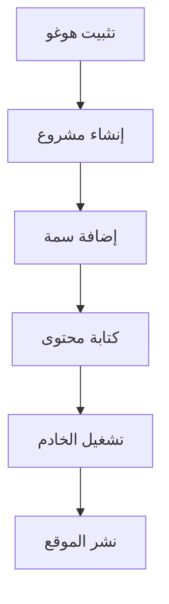

# **توثيق هوغو - الصفحة الرئيسية**

**مرحبًا بكم في توثيق هوغو باللغة العربية!**


_هوغو - إطار عمل سريع وحديث لبناء المواقع الإلكترونية._

## **📌 مقدمة**

هوغو هو مولد مواقع ثابتة (Static Site Generator) مبني على لغة Go، يتميز بالسرعة والمرونة وسهولة الاستخدام. سيقدم هذا التوثيق شرحًا مفصلاً لاستخدام هوغو باللغة العربية.

إذا كنت جديدًا في هوغو، فلنبدأ بشرح مبسط.

---

## **🚀 لماذا تختار هوغو؟**

يقدم هوغو العديد من المميزات، مثل:

- ⚡ **السرعة** – مبنية بلغة Go، يقوم هوغو بإنشاء المواقع في أجزاء من الثانية.
- 📂 **سهولة الاستخدام** – بناء على Markdown وقوالب قوية.
- 🛠 **المرونة** – مناسب للمدونات، المواقع الشخصية، التوثيق، وغيرها.
- 🌍 **مجتمع نشط** – دعم كبير من المطورين حول العالم.

---

## **📖 أساسيات هوغو**

### **1. تثبيت هوغو**

لبدء استخدام هوغو، يجب تثبيته أولاً. إليك الطريقة:

#### **على ويندوز (باستخدام Chocolatey):**

```powershell
choco install hugo -confirm
```

#### **على macOS (باستخدام Homebrew):**

```bash
brew install hugo
```

#### **على لينكس (Debian/Ubuntu):**

```bash
sudo apt-get install hugo
```

### **2. إنشاء مشروع جديد**

بعد التثبيت، أنشئ موقعًا جديدًا بالأمر:

```bash
hugo new site اسم-المشروع
```

### **3. تشغيل خادم محلي**

لرؤية النتائج فورًا، استخدم:

```bash
hugo server -D
```

ثم افتح `http://localhost:1313` في متصفحك.

---

## **🔧 الميزات الرئيسية في هوغو**

### **📝 المحتوى باستخدام Markdown**

يستخدم هوغو Markdown لإنشاء المحتوى. مثال:

```markdown
---
title: "المقال الأول"
date: 2025-07-25
---

# مرحبًا بالعالم!

هذه هي مقالتي الأولى باستخدام هوغو.
```

### **🎨 القوالب والسمات**

يدعم هوغو العديد من السمات. ثبّت سمة باستخدام:

```bash
git clone https://github.com/صاحب-السمة/اسم-السمة.git themes/اسم-السمة
```

ثم اضبط في ملف `config.toml`:

```toml
theme = "اسم-السمة"
```

### **⚙️ إعدادات الموقع**

ملف `config.toml` هو مركز التحكم في هوغو. مثال:

```toml
baseURL = "https://example.com/"
languageCode = "ar"
title = "موقعي بهوغو"
```

---

## **📌 نصائح وحيل**

✅ **استخدم Shortcodes** – تُسهّل إدراج العناصر الديناميكية.  
✅ **تحسين الصور** – يدعم هوغو معالجة الصور مدمجة.  
✅ **النشر بسهولة** – يمكن استضافته على Netlify أو Vercel أو GitHub Pages.

---

## **❓ الأسئلة الشائعة (FAQ)**

### **❔ هل هوغو مناسب للمبتدئين؟**

نعم! هوغو سهل التعلم بفضل توثيقه الواضح.

### **❔ هل يمكن استخدام هوغو للتجارة الإلكترونية؟**

هوغو مولد مواقع ثابتة، لذا لا يناسب المتاجر الديناميكية، لكن يمكن دمجه مع أدوات مثل Snipcart.

### **❔ كيف أضيف نظام تعليقات؟**

استخدم خدمات مثل Disqus أو Utterances (المعتمد على GitHub).

---

## **📚 مراجع إضافية**

- [التوثيق الرسمي لهوغو](https://gohugo.io/documentation/)
- [منتدى مجتمع هوغو](https://discourse.gohugo.io/)
- [مجموعة سمات هوغو](https://themes.gohugo.io/)

---

**🎉 مبروك! أنت جاهز لبدء رحلتك مع هوغو.**  
إذا كان لديك أي سؤال، يُرجى زيارة [قسم المناقشات](https://github.com/gohugoio/hugo/discussions) على GitHub.

---

**© 2025 توثيق هوغو بالعربية** | صنع ب ❤️ للمطورين العرب.

---

### **🎨 رسم توضيحي (اختياري)**



_رسم تخطيطي لسير عمل هوغو._

---

تم تصميم هذا التوثيق لمساعدة المبتدئين على فهم هوغو بسهولة. نتمنى لك تجربة ممتعة! 🚀
