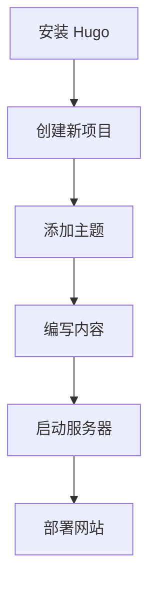

# **Hugo 文档 - 首页**

**欢迎来到 Hugo 的中文版文档！**

  
_Hugo - 一个快速且现代的网站构建框架_

## **📌 简介**

Hugo 是一个基于 Go 语言的**静态网站生成器**（Static Site Generator，SSG），它快速、灵活且易于使用。本文档将帮助您了解如何使用 Hugo（中文版）。

如果您是 Hugo 的新用户，可以从以下简要介绍开始。

---

## **🚀 为什么选择 Hugo？**

Hugo 具有许多优势，例如：

- ⚡ **极速生成** – 基于 Go 语言构建，Hugo 能在毫秒级别生成网站。
- 📂 **简单易用** – 使用 Markdown 和强大的模板系统，语法简洁。
- 🛠 **高度灵活** – 适用于博客、作品集、文档等多种用途。
- 🌍 **活跃社区** – 全球开发者提供广泛支持。

---

## **📖 Hugo 基础入门**

### **1. 安装 Hugo**

要开始使用 Hugo，首先需要安装它。以下是安装方法：

#### **Windows（通过 Chocolatey）:**

```powershell
choco install hugo -confirm
```

#### **macOS（通过 Homebrew）:**

```bash
brew install hugo
```

#### **Linux（Debian/Ubuntu）:**

```bash
sudo apt-get install hugo
```

### **2. 创建新项目**

安装完成后，使用以下命令创建新网站：

```bash
hugo new site 项目名称
```

### **3. 启动本地服务器**

要实时预览网站，运行：

```bash
hugo server -D
```

然后在浏览器中访问 `http://localhost:1313`。

---

## **🔧 Hugo 主要功能**

### **📝 使用 Markdown 编写内容**

Hugo 使用 Markdown 来管理内容。例如：

```markdown
---
title: "我的第一篇文章"
date: 2025-07-25
---

# 你好，世界！

这是我的第一篇 Hugo 文章。
```

### **🎨 模板与主题**

Hugo 支持多种主题。安装主题的方法：

```bash
git clone https://github.com/作者名/主题名.git themes/主题名
```

然后在 `config.toml` 中设置：

```toml
theme = "主题名"
```

### **⚙️ 网站配置**

`config.toml` 是 Hugo 的核心配置文件。示例：

```toml
baseURL = "https://example.com/"
languageCode = "zh-cn"
title = "我的 Hugo 网站"
```

---

## **📌 实用技巧**

✅ **使用 Shortcodes** – 方便插入动态内容（如视频、表格等）。  
✅ **图片优化** – Hugo 内置图片处理功能。  
✅ **轻松部署** – 可托管在 Netlify、Vercel 或 GitHub Pages 上。

---

## **❓ 常见问题（FAQ）**

### **❔ Hugo 适合新手吗？**

是的！Hugo 文档齐全，学习曲线平缓。

### **❔ Hugo 能用于电商网站吗？**

Hugo 是静态网站生成器，不适合动态电商系统，但可集成 Snipcart 等解决方案。

### **❔ 如何添加评论功能？**

可使用 Disqus 或基于 GitHub 的 Utterances。

---

## **📚 进阶参考**

- [Hugo 官方文档](https://gohugo.io/documentation/)
- [Hugo 社区论坛](https://discourse.gohugo.io/)
- [Hugo 主题库](https://themes.gohugo.io/)

---

**🎉 恭喜！您已准备好开始使用 Hugo。**  
如有疑问，请访问 [GitHub 讨论区](https://github.com/gohugoio/hugo/discussions)。

---

**© 2025 Hugo 中文文档** | 用心为中文开发者打造。

---

### **🎨 可视化流程图（可选）**



_Hugo 工作流程示意图_

---

本文档旨在帮助新手快速上手 Hugo。希望对您有所帮助！🚀
