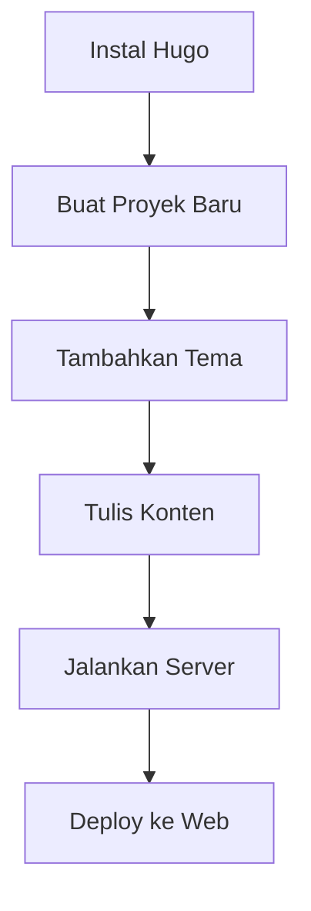

[[about]]

**Selamat datang di dokumentasi Hugo versi Bahasa Indonesia!**

  
_Hugo - Framework cepat & modern untuk membangun website._

## **📌 Pengantar**

Hugo adalah _static site generator_ (SSG) berbasis Go yang cepat, fleksibel, dan mudah digunakan. Dokumentasi ini akan membantu Anda memahami cara menggunakan Hugo dalam Bahasa Indonesia.

Jika Anda baru mengenal Hugo, mari mulai dengan penjelasan singkat berikut.

---

## **🚀 Mengapa Memilih Hugo?**

Hugo menawarkan banyak keunggulan, seperti:

- ⚡ **Cepat** – Dibangun dengan Go, Hugo menghasilkan situs dalam hitungan milidetik.
- 📂 **Mudah Digunakan** – Sintaksis sederhana dengan Markdown dan template yang kuat.
- 🛠 **Fleksibel** – Cocok untuk blog, portofolio, dokumentasi, dan banyak lagi.
- 🌍 **Komunitas Aktif** – Dukungan luas dari pengembang di seluruh dunia.

---

## **📖 Dasar-Dasar Hugo**

### **1. Instalasi Hugo**

Untuk mulai menggunakan Hugo, Anda perlu menginstalnya terlebih dahulu. Berikut caranya:

#### **Di Windows (via Chocolatey):**

```powershell
choco install hugo -confirm
```

#### **Di macOS (via Homebrew):**

```bash
brew install hugo
```

#### **Di Linux (Debian/Ubuntu):**

```bash
sudo apt-get install hugo
```

### **2. Membuat Proyek Baru**

Setelah terinstal, buat situs baru dengan perintah:

```bash
hugo new site nama-proyek
```

### **3. Menjalankan Server Lokal**

Untuk melihat hasilnya secara real-time, jalankan:

```bash
hugo server -D
```

Buka `http://localhost:1313` di browser Anda.

---

## **🔧 Fitur Utama Hugo**

### **📝 Konten dengan Markdown**

Hugo menggunakan Markdown untuk membuat konten. Contoh:

```markdown
---
title: "Artikel Pertama"
date: 2025-07-25
---

# Halo Dunia!

Ini adalah artikel pertama saya dengan Hugo.
```

### **🎨 Template & Tema**

Hugo mendukung berbagai tema. Pasang tema dengan:

```bash
git clone https://github.com/nama-pembuat/nama-tema.git themes/nama-tema
```

Lalu atur di `config.toml`:

```toml
theme = "nama-tema"
```

### **⚙️ Konfigurasi Situs**

File `config.toml` adalah pusat pengaturan Hugo. Contoh:

```toml
baseURL = "https://contoh.com/"
languageCode = "id-id"
title = "Situs Hugo Saya"
```

---

## **📌 Tips & Trik**

✅ **Gunakan Shortcodes** – Mempermudah penyisipan elemen dinamis.  
✅ **Optimasi Gambar** – Hugo mendukung _image processing_ bawaan.  
✅ **Deploy dengan Mudah** – Dapat di-hosting di Netlify, Vercel, atau GitHub Pages.

---

## **❓ Pertanyaan Umum (FAQ)**

### **❔ Apakah Hugo cocok untuk pemula?**

Ya! Hugo memiliki kurva belajar yang landai berkat dokumentasi yang lengkap.

### **❔ Bisakah Hugo digunakan untuk e-commerce?**

Hugo adalah _static site generator_, jadi tidak cocok untuk e-commerce dinamis. Namun, bisa diintegrasikan dengan solusi seperti Snipcart.

### **❔ Bagaimana cara menambahkan komentar?**

Gunakan layanan seperti Disqus atau Utterances (berbasis GitHub).

---

## **📚 Referensi Lanjutan**

- [Dokumentasi Resmi Hugo](https://gohugo.io/documentation/)
- [Forum Komunitas Hugo](https://discourse.gohugo.io/)
- [Koleksi Tema Hugo](https://themes.gohugo.io/)

---

**🎉 Selamat! Anda siap memulai dengan Hugo.**  
Jika ada pertanyaan, silakan buka [bagian diskusi](https://github.com/gohugoio/hugo/discussions) di GitHub.

---

**© 2025 Dokumentasi Hugo Bahasa Indonesia** | Dibuat dengan ❤️ untuk developer Indonesia.

---

### **🎨 Tampilan Visual (Opsional)**



_Grafik alur kerja Hugo._

---

Dokumentasi ini dirancang untuk memudahkan pemula memahami Hugo dengan cepat. Semoga membantu! 🚀
