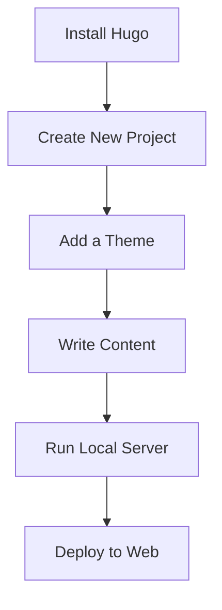

# **Hugo Documentation - Homepage**

**Welcome to the Hugo Documentation in English!**

  
_Hugo - A fast & modern framework for building websites._

## **📌 Introduction**

Hugo is a **static site generator (SSG)** built with Go, known for its speed, flexibility, and ease of use. This documentation will guide you through using Hugo effectively.

If you're new to Hugo, let's start with a quick overview.

---

## **🚀 Why Choose Hugo?**

Hugo offers several advantages, including:

- ⚡ **Blazing Fast** – Built with Go, Hugo generates sites in milliseconds.
- 📂 **Easy to Use** – Simple Markdown syntax and powerful templating.
- 🛠 **Highly Flexible** – Perfect for blogs, portfolios, documentation, and more.
- 🌍 **Active Community** – Strong support from developers worldwide.

---

## **📖 Hugo Basics**

### **1. Installing Hugo**

To get started, install Hugo on your system:

#### **Windows (via Chocolatey):**

```powershell
choco install hugo -confirm
```

#### **macOS (via Homebrew):**

```bash
brew install hugo
```

#### **Linux (Debian/Ubuntu):**

```bash
sudo apt-get install hugo
```

### **2. Creating a New Project**

After installation, create a new site with:

```bash
hugo new site project-name
```

### **3. Running a Local Server**

To preview your site in real-time, run:

```bash
hugo server -D
```

Open `http://localhost:1313` in your browser.

---

## **🔧 Key Features**

### **📝 Content with Markdown**

Hugo uses Markdown for content creation. Example:

```markdown
---
title: "My First Post"
date: 2025-07-25
---

# Hello World!

This is my first post with Hugo.
```

### **🎨 Themes & Templates**

Hugo supports customizable themes. Install a theme via:

```bash
git clone https://github.com/author/theme-name.git themes/theme-name
```

Then, configure it in `config.toml`:

```toml
theme = "theme-name"
```

### **⚙️ Site Configuration**

The `config.toml` file controls global settings. Example:

```toml
baseURL = "https://example.com/"
languageCode = "en-us"
title = "My Hugo Site"
```

---

## **📌 Tips & Tricks**

✅ **Use Shortcodes** – Simplify dynamic content insertion.  
✅ **Optimize Images** – Hugo supports built-in image processing.  
✅ **Easy Deployment** – Host on Netlify, Vercel, or GitHub Pages.

---

## **❓ Frequently Asked Questions (FAQ)**

### **❔ Is Hugo beginner-friendly?**

Yes! Hugo has a gentle learning curve thanks to comprehensive docs.

### **❔ Can Hugo be used for e-commerce?**

Hugo is a static site generator, so it’s not ideal for dynamic e-commerce. However, it can integrate with solutions like Snipcart.

### **❔ How do I add comments?**

Use services like Disqus or Utterances (GitHub-based).

---

## **📚 Further Reading**

- [Official Hugo Documentation](https://gohugo.io/documentation/)
- [Hugo Community Forum](https://discourse.gohugo.io/)
- [Hugo Themes Gallery](https://themes.gohugo.io/)

---

**🎉 Congrats! You’re ready to start with Hugo.**  
For questions, visit the [GitHub discussions](https://github.com/gohugoio/hugo/discussions).

---

**© 2025 Hugo Documentation in English** | Made with ❤️ for developers.

---

### **🎨 Visual Guide (Optional)**



_Hugo workflow diagram._

---

This documentation is designed to help beginners get started quickly. Happy coding! 🚀
